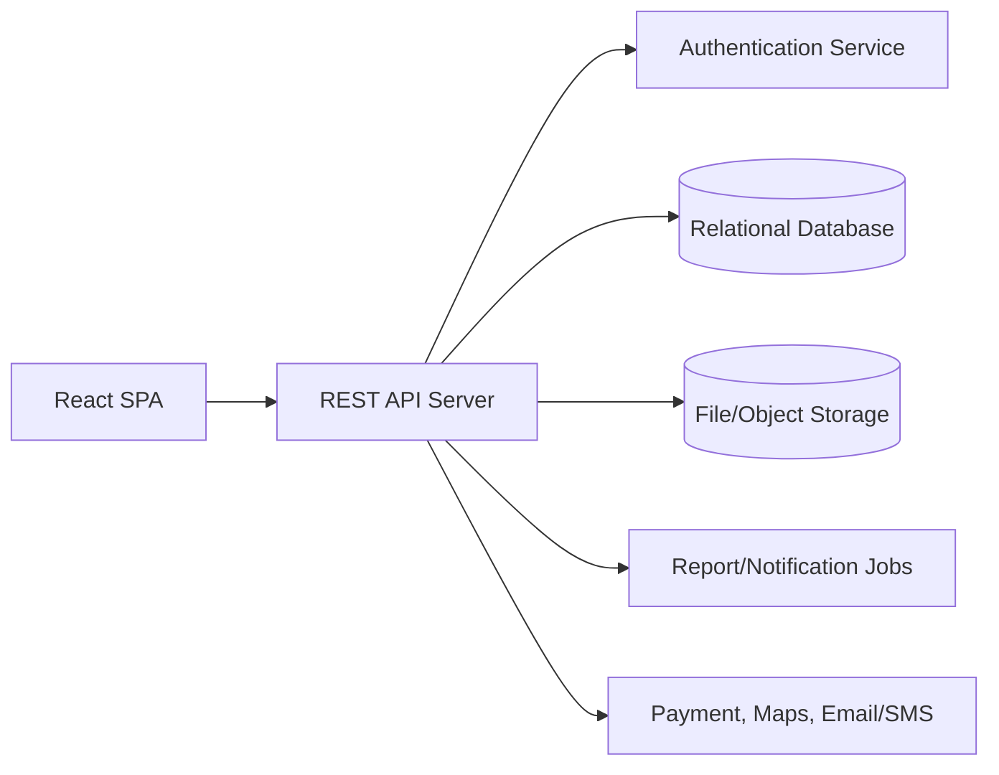
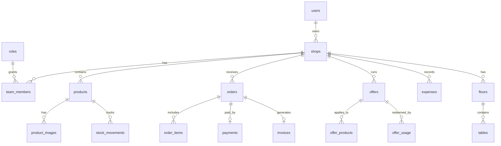
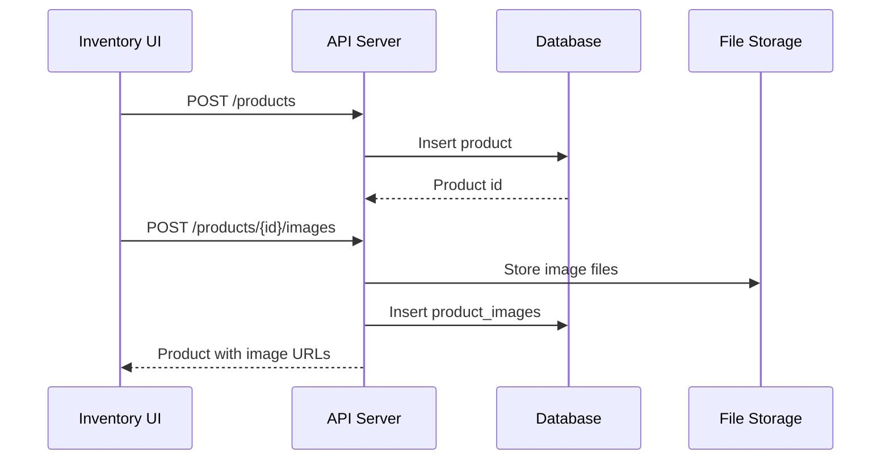
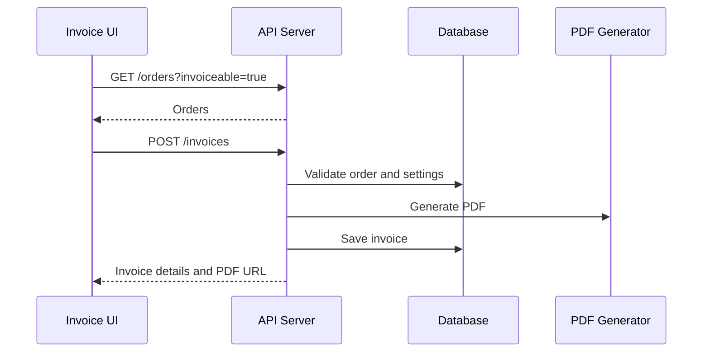
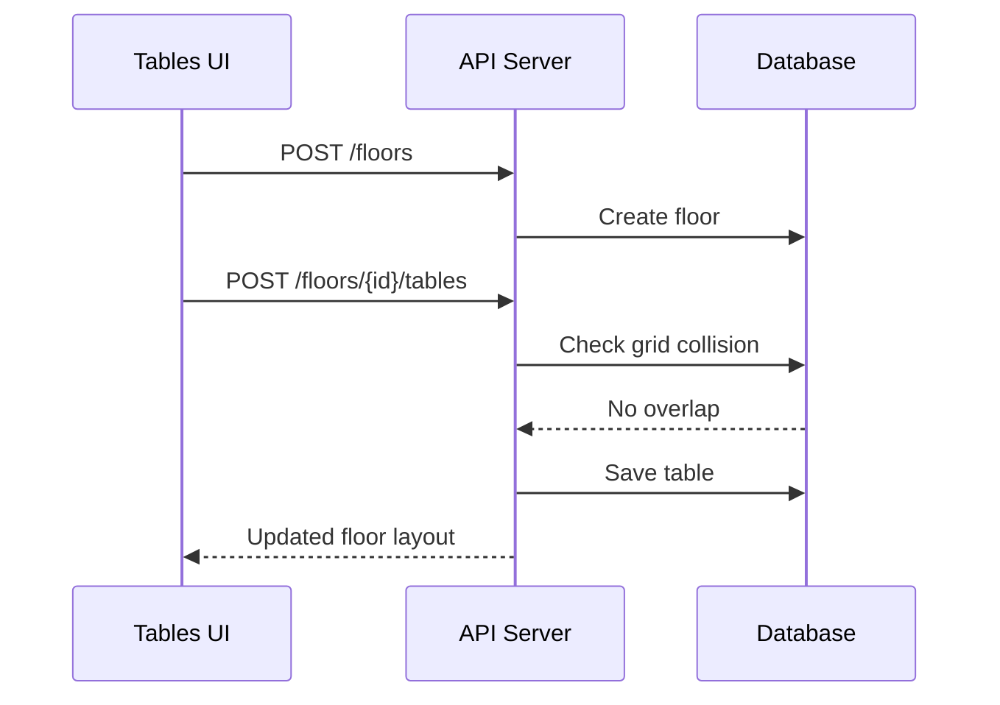

# ShopLocal API Documentation

Version: 1.0  
Status: Proposed backend contract for the current React application  
Frontend: React + TypeScript + Vite  
Audience: Backend developers, frontend developers, QA, and product engineers

## 1. Project Overview And Architecture

ShopLocal is a store management application for local retail operations. The current frontend contains dashboard, inventory, orders, table layout, offers, expenses, invoices, settings, and shop management modules. Most screens currently use local state and dummy data, so this document defines the API contract required to connect the UI to a production backend.

### High Level Architecture



### Frontend Pages

| Page | Route/Page Id | Main Purpose |
|---|---|---|
| Dashboard | `dashboard` | Business summary, earnings chart, orders, stock alerts, reports |
| Inventory | `inventory` | Product listing, product create/edit/profile, stock and image management |
| Orders | `orders` | Order list, filtering, status updates, order details |
| Tables | `tables` | Floor/table layout builder, table status, table order start |
| Offers | `offers` | Offer list, offer creation, coupon rules, performance |
| Expenses | `expenses` | Expense tracker, charts, expense create/edit/delete |
| Invoices | `invoices` | Invoice list, invoice generation, invoice preview/download/share |
| Settings | `settings` | Store, preferences, invoice, security, export, support settings |
| Manage Shops | `shops` | Multi-shop switching and shop creation |

## 2. API Base URLs And Environment Configuration

| Environment | Base URL |
|---|---|
| Local | `http://localhost:4000/api/v1` |
| Staging | `https://staging-api.shoplocal.example.com/api/v1` |
| Production | `https://api.shoplocal.example.com/api/v1` |

### Required Frontend Environment Variables

| Variable | Example | Description |
|---|---|---|
| `VITE_API_BASE_URL` | `http://localhost:4000/api/v1` | REST API base URL |
| `VITE_FILE_BASE_URL` | `https://cdn.shoplocal.example.com` | Public file URL base |
| `VITE_APP_ENV` | `local` | Runtime environment |

### Standard Headers

| Header | Required | Description |
|---|---:|---|
| `Authorization: Bearer <token>` | Yes | JWT access token |
| `X-Shop-Id: <shop_id>` | Yes, after login | Active shop context |
| `Content-Type: application/json` | Yes for JSON | JSON request body |
| `Accept: application/json` | Yes | JSON response |
| `X-Request-Id: <uuid>` | Optional | Client generated trace id |

For file upload APIs, use `Content-Type: multipart/form-data`.

## 3. Authentication And Authorization

All protected APIs require a valid bearer token. Every business API must also validate that the authenticated user has access to the active `X-Shop-Id`.

### Roles

| Role | Description |
|---|---|
| Owner | Full access to all shops, billing, settings, delete operations |
| Manager | Operational access to inventory, orders, offers, expenses, invoices |
| Staff | Basic order, inventory view, and POS operations |
| Accountant | Expenses, invoices, reports, exports |
| Waiter | Table management and table orders |
| Viewer | Read-only access |

### Permission Matrix

| Module | Owner | Manager | Staff | Accountant | Waiter | Viewer |
|---|---|---|---|---|---|---|
| Dashboard | Full | Full | Read | Read | Read | Read |
| Inventory | Full | Full | Limited | Read | Read | Read |
| Orders | Full | Full | Full | Read | Table only | Read |
| Tables | Full | Full | Read | No | Full | Read |
| Offers | Full | Full | No | Read | No | Read |
| Expenses | Full | Full | No | Full | No | Read |
| Invoices | Full | Full | No | Full | No | Read |
| Settings | Full | Limited | No | Limited | No | Read |
| Shops | Full | Limited | No | No | No | Read |

## 4. Standard Response Format

### Success Response

```json
{
  "success": true,
  "data": {},
  "meta": {
    "requestId": "6cc55b75-5d85-4e9c-a7f8-47649dd6d951"
  }
}
```

### Paginated Response

```json
{
  "success": true,
  "data": [],
  "meta": {
    "page": 1,
    "limit": 10,
    "total": 94,
    "totalPages": 10,
    "hasNext": true,
    "hasPrev": false
  }
}
```

### Error Response

```json
{
  "success": false,
  "error": {
    "code": "VALIDATION_ERROR",
    "message": "One or more fields are invalid.",
    "details": [
      {
        "field": "price",
        "message": "Price must be greater than or equal to 0."
      }
    ]
  }
}
```

## 5. Status Codes And Error Handling

| Status | Meaning | Common Use |
|---:|---|---|
| 200 | OK | Read/update success |
| 201 | Created | Resource created |
| 204 | No Content | Delete success |
| 400 | Bad Request | Invalid query/body format |
| 401 | Unauthorized | Missing or invalid token |
| 403 | Forbidden | Role does not have permission |
| 404 | Not Found | Resource does not exist |
| 409 | Conflict | Duplicate code/name, overlapping table, invalid state transition |
| 413 | Payload Too Large | File too large |
| 415 | Unsupported Media Type | Invalid upload file type |
| 422 | Validation Error | Business validation failed |
| 429 | Too Many Requests | Rate limit exceeded |
| 500 | Server Error | Unexpected server failure |

## 6. Pagination, Filtering, Sorting, And Search

All list APIs should support consistent query parameters.

| Parameter | Type | Description |
|---|---|---|
| `page` | integer | Page number, starts at 1 |
| `limit` | integer | Items per page, default 10, max 100 |
| `search` | string | Free-text search |
| `sortBy` | string | Field name |
| `sortOrder` | `asc` or `desc` | Sort direction |

Example:

```http
GET /api/v1/products?search=butter&category=Dairy&stockLevel=inStock&sortBy=name&sortOrder=asc&page=1&limit=10
```

## 7. Dashboard APIs

### Functionality

- View revenue, stock alerts, high demand items, and out of stock counts.
- View earnings chart by week, month, or year.
- View today orders and pending orders.
- Toggle active offers.
- Export reports.

### Endpoints

| Method | Endpoint | Description |
|---|---|---|
| GET | `/dashboard/summary` | Dashboard metric cards |
| GET | `/dashboard/earnings` | Earnings chart |
| GET | `/dashboard/orders/today` | Today orders |
| GET | `/dashboard/orders/pending` | Pending orders |
| GET | `/dashboard/offers/active` | Active offer rows |
| PATCH | `/offers/{offerId}/status` | Activate or pause an offer |
| GET | `/reports/{type}/export` | Export report CSV/PDF |

### Query Parameters

| Endpoint | Parameters |
|---|---|
| `/dashboard/earnings` | `range=W|M|Y` |
| `/dashboard/orders/today` | `page`, `limit`, `status` |
| `/dashboard/orders/pending` | `limit` |
| `/reports/{type}/export` | `format=csv|pdf`, `from`, `to` |

### Sample Response

```json
{
  "success": true,
  "data": {
    "revenueToday": 18420,
    "lowStockCount": 7,
    "highDemandCount": 12,
    "outOfStockCount": 3,
    "currency": "INR"
  }
}
```

## 8. Inventory APIs

### Functionality

- Search, filter, sort, and paginate products.
- Create products with images.
- View product profile.
- Update stock with plus/minus controls.
- Toggle product visibility.
- Delete product.
- Upload more than four images and delete a single image.
- Set primary image.

### Endpoints

| Method | Endpoint | Description |
|---|---|---|
| GET | `/products` | Product list |
| POST | `/products` | Create product |
| GET | `/products/{productId}` | Product profile |
| PUT | `/products/{productId}` | Full product update |
| PATCH | `/products/{productId}/stock` | Increment/decrement stock |
| PATCH | `/products/{productId}/visibility` | Toggle availability |
| DELETE | `/products/{productId}` | Delete product |
| POST | `/products/{productId}/images` | Upload product images |
| DELETE | `/products/{productId}/images/{imageId}` | Delete product image |
| PATCH | `/products/{productId}/primary-image` | Set primary image |
| GET | `/inventory/alerts` | Stock and expiry alerts |

### Product Create Body

| Field | Type | Required | Validation |
|---|---|---:|---|
| `name` | string | Yes | 2-120 characters |
| `brand` | string | No | Max 80 characters |
| `model` | string | No | Max 80 characters |
| `category` | string | Yes | Existing category |
| `description` | string | No | Max 1000 characters |
| `supplierName` | string | No | Max 120 characters |
| `sellingPrice` | number | Yes | `>= 0` |
| `stockQuantity` | integer | Yes | `>= 0` |
| `lowStockThreshold` | integer | Yes | `>= 0` |
| `expirationDate` | string | No | ISO date |
| `available` | boolean | Yes | Default `true` |

### Sample Create Product

```json
{
  "name": "Amul Butter 200g",
  "brand": "Amul",
  "model": "Butter 200g",
  "category": "Dairy",
  "description": "Premium butter for daily use.",
  "supplierName": "Amul Distributor",
  "sellingPrice": 120,
  "stockQuantity": 60,
  "lowStockThreshold": 10,
  "expirationDate": "2026-08-12",
  "available": true
}
```

### Stock Update Body

```json
{
  "operation": "increment",
  "quantity": 1,
  "reason": "Manual stock correction"
}
```

`operation` must be `increment`, `decrement`, or `set`. Stock cannot become negative.

### Image Upload

```http
POST /api/v1/products/PRD-0110/images
Content-Type: multipart/form-data
```

| Field | Type | Validation |
|---|---|---|
| `files[]` | file[] | JPG, PNG, PDF, max 5MB per file |

## 9. Orders APIs

### Functionality

- All Orders and New Orders tabs.
- Search by order id or customer.
- Filter by order date, order type, price range, payment type, and status.
- Update each order status independently.
- View order details with timeline, items, payment, and summary.
- Print invoice from order detail.

### Endpoints

| Method | Endpoint | Description |
|---|---|---|
| GET | `/orders` | Order list |
| GET | `/orders/{orderId}` | Order details |
| PATCH | `/orders/{orderId}/status` | Update order status |
| GET | `/orders/{orderId}/invoice` | Get invoice linked to order |
| POST | `/orders/{orderId}/print-invoice` | Print invoice request |

### Order Query Parameters

| Parameter | Type | Description |
|---|---|---|
| `tab` | `all` or `new` | Current tab |
| `search` | string | Order id/customer search |
| `date` | string | ISO date or named range |
| `type` | string | Online, COD, POS |
| `priceMin` | number | Minimum total |
| `priceMax` | number | Maximum total |
| `paymentType` | string | Online, COD, UPI, Card, Cash |
| `status` | string | Delivered, Out For Delivery, Preparing, Returned, Cancelled |

### Status Update Body

```json
{
  "status": "Preparing",
  "note": "Kitchen preparation started"
}
```

### Order Detail Response

```json
{
  "success": true,
  "data": {
    "id": "ORD-123456",
    "customer": {
      "name": "Jade Gloud",
      "phone": "+1234567890",
      "address": "Customer address"
    },
    "status": "Delivered",
    "payment": {
      "method": "UPI",
      "status": "Paid",
      "transactionId": "TXN48821093"
    },
    "items": [
      {
        "productId": "PRD-001",
        "name": "Flower Fabric",
        "quantity": 2,
        "mrp": 60,
        "sellingPrice": 60,
        "subtotal": 120
      }
    ],
    "summary": {
      "subtotal": 480,
      "discount": 0,
      "tax": 24,
      "delivery": 0,
      "total": 504
    }
  }
}
```

## 10. Tables APIs

### Functionality

- Manage floors and table layouts.
- Upload layout image.
- Drag small and large tables into layout cells.
- Prevent overlapping table placement.
- Manually rotate selected table.
- Change table status by user choice.
- Create an order from an available table.

### Endpoints

| Method | Endpoint | Description |
|---|---|---|
| GET | `/floors` | List floors |
| POST | `/floors` | Create floor |
| GET | `/floors/{floorId}` | Floor layout details |
| PUT | `/floors/{floorId}` | Update floor info and layout |
| PATCH | `/floors/{floorId}/enabled` | Enable or disable floor |
| DELETE | `/floors/{floorId}` | Delete floor |
| POST | `/floors/{floorId}/layout-image` | Upload floor layout image |
| POST | `/floors/{floorId}/tables` | Add table to floor |
| PATCH | `/floors/{floorId}/tables/{tableId}` | Move, rename, resize, or rotate table |
| PATCH | `/floors/{floorId}/tables/{tableId}/status` | Change table status |
| DELETE | `/floors/{floorId}/tables/{tableId}` | Delete table |
| POST | `/tables/{tableId}/orders` | Create order for table |

### Create Floor Body

```json
{
  "number": 4,
  "type": "Indoor",
  "enabled": true
}
```

### Add Table Body

```json
{
  "name": "A13",
  "kind": "wide",
  "status": "available",
  "gridColumn": 5,
  "gridRow": 4,
  "columnSpan": 3,
  "rowSpan": 2,
  "rotation": 18
}
```

Validation rules:

| Field | Rule |
|---|---|
| `name` | Required, unique per floor |
| `kind` | `small`, `wide`, or `tall` |
| `status` | `available`, `busy`, or `reserved` |
| `gridColumn`, `gridRow` | Must be inside layout grid |
| `columnSpan`, `rowSpan` | Small table uses 2 cells, large table uses 6 cells |
| `rotation` | `0` to `359` degrees |
| Placement | Must not overlap another table |

### Overlap Error

```json
{
  "success": false,
  "error": {
    "code": "TABLE_OVERLAP",
    "message": "The selected cells are already occupied by another table."
  }
}
```

## 11. Offers APIs

### Functionality

- View offer metrics and active offers.
- Select offers with checkboxes.
- Bulk activate/pause offers.
- Create offer with coupon code, type, value, rules, products, and validity.
- View offer performance chart.

### Endpoints

| Method | Endpoint | Description |
|---|---|---|
| GET | `/offers/metrics` | Offer summary cards |
| GET | `/offers` | Offer list |
| POST | `/offers` | Create offer |
| GET | `/offers/{offerId}` | Offer details |
| PUT | `/offers/{offerId}` | Update offer |
| PATCH | `/offers/{offerId}/status` | Activate or pause offer |
| POST | `/offers/bulk/status` | Bulk status update |
| DELETE | `/offers/{offerId}` | Delete offer |
| GET | `/offers/performance` | Chart and insights |
| POST | `/offers/coupon-code` | Generate unique coupon code |

### Create Offer Body

```json
{
  "name": "Weekend sale",
  "hasCouponCode": true,
  "couponCode": "WEEKEND50",
  "type": "Percentage discount",
  "discountValue": 20,
  "applyTo": "specific_products",
  "productIds": ["PRD-001", "PRD-002"],
  "minOrderValue": 200,
  "maxDiscountCap": 100,
  "usageLimitPerCustomer": 1,
  "overallUsageLimit": 500,
  "startDate": "2026-05-15",
  "endDate": "2026-06-15",
  "active": true
}
```

Validation rules:

| Field | Rule |
|---|---|
| `couponCode` | Required if coupon enabled, uppercase, unique |
| `type` | One of Flat discount, Percentage discount, Combo discount, Add-ons combo, Freebie offer |
| `discountValue` | Required, greater than 0 |
| Percentage value | Must be 1-100 |
| `productIds` | Required when `applyTo=specific_products` |
| `startDate` and `endDate` | Start date must be before or equal to end date |
| Coupon restriction | Combo, add-on, and freebie offers cannot use coupon code |

## 12. Expenses APIs

### Functionality

- Expense metrics.
- Category breakdown donut chart.
- Daily expenses chart with hover tooltip.
- Search, filter, sort, and paginate expenses.
- Add, edit, and delete expenses.

### Endpoints

| Method | Endpoint | Description |
|---|---|---|
| GET | `/expenses/metrics` | Total and average expense |
| GET | `/expenses/breakdown` | Category breakdown chart |
| GET | `/expenses/daily` | Daily expenses chart |
| GET | `/expenses` | Expense list |
| POST | `/expenses` | Add expense |
| GET | `/expenses/{expenseId}` | Expense details |
| PUT | `/expenses/{expenseId}` | Edit expense |
| DELETE | `/expenses/{expenseId}` | Delete expense |

### Expense Body

```json
{
  "title": "Electricity bill",
  "amount": 900,
  "date": "2026-05-14",
  "category": "Utilities",
  "paymentMethod": "UPI",
  "notes": "TNEB bill, April cycle"
}
```

Validation rules:

| Field | Rule |
|---|---|
| `title` | Required, 2-120 characters |
| `amount` | Required, number greater than or equal to 0 |
| `date` | Required ISO date |
| `category` | Inventory, Shop rent, Utilities, Salaries, Transport, Maintenance, Miscellaneous |
| `paymentMethod` | Cash, UPI, Card |
| `notes` | Optional, max 500 characters |

## 13. Invoices APIs

### Functionality

- Invoice metrics.
- Invoice list with status/month/sort filters.
- Generate invoice from order.
- Configure invoice prefix, currency, tax, and address.
- View, print, share, download, and delete invoice.

### Endpoints

| Method | Endpoint | Description |
|---|---|---|
| GET | `/invoices/metrics` | Invoice summary cards |
| GET | `/invoices` | Invoice list |
| GET | `/invoices/{invoiceId}` | Invoice details |
| POST | `/invoices` | Generate invoice |
| DELETE | `/invoices/{invoiceId}` | Delete invoice |
| GET | `/orders` | Search invoiceable orders with `invoiceable=true` |
| GET | `/invoices/{invoiceId}/pdf` | Download invoice PDF |
| POST | `/invoices/{invoiceId}/share` | Share invoice |
| POST | `/invoices/{invoiceId}/print` | Print invoice |
| PUT | `/invoice-settings` | Save invoice settings |

### Generate Invoice Body

```json
{
  "orderId": "ORD-8821",
  "invoicePrefix": "INV-2026",
  "currency": "INR",
  "sgstPercentage": 2.5,
  "cgstPercentage": 2.5,
  "registeredAddress": "No. 12, Gandhi Bazaar Road, Coimbatore - 641001"
}
```

### Invoice Response

```json
{
  "success": true,
  "data": {
    "invoiceId": "INV-2026-0094",
    "orderId": "ORD-8821",
    "customer": "Arjun Natarajan",
    "status": "Paid",
    "subtotal": 321,
    "sgst": 8,
    "cgst": 8,
    "total": 337,
    "pdfUrl": "https://cdn.shoplocal.example.com/invoices/INV-2026-0094.pdf"
  }
}
```

## 14. Settings APIs

### Functionality

- Store profile and photo.
- Payment method toggles.
- Team members.
- App preferences.
- Notification toggles.
- Invoice settings.
- Account security, 2FA, password, devices.
- Subscription plans.
- Data exports.
- Support and legal links.

### Endpoints

| Method | Endpoint | Description |
|---|---|---|
| GET | `/settings` | Complete settings snapshot |
| PUT | `/settings/store-profile` | Save store profile |
| POST | `/settings/store-photo` | Upload store photo |
| DELETE | `/settings/store-photo` | Remove store photo |
| PUT | `/settings/payment-methods` | Save accepted payment methods |
| GET | `/team-members` | List team members |
| POST | `/team-members` | Add team member |
| DELETE | `/team-members/{memberId}` | Remove team member |
| PUT | `/settings/preferences` | Save language/date/currency |
| PUT | `/settings/notifications` | Save notification settings |
| PUT | `/settings/invoice` | Save invoice settings |
| PATCH | `/account/security/2fa` | Toggle 2FA |
| POST | `/account/password/change` | Change password |
| GET | `/account/login-activity` | View login activity |
| GET | `/account/devices` | View connected devices |
| DELETE | `/account` | Delete account |
| GET | `/plans` | Subscription plans |
| POST | `/subscriptions` | Subscribe or upgrade |
| GET | `/exports/{module}` | Download CSV/PDF export |
| GET | `/support/articles` | Help articles |
| POST | `/support/tickets` | Create support ticket |

### Store Profile Body

```json
{
  "storeName": "ShopLocal",
  "contactNumber": "+919876543210",
  "description": "Local grocery and daily essentials store.",
  "address": "No. 12, Gandhi Bazaar Road, Coimbatore - 641001",
  "operatingHours": "9:00 AM - 9:00 PM",
  "hotlineContact": "+919876543210",
  "coordinates": "11.0168,76.9558"
}
```

## 15. Manage Shops APIs

### Functionality

- List all shops connected to the account.
- Switch active shop.
- Add new shop.
- Open/close shop.
- View plan shop limits.

### Endpoints

| Method | Endpoint | Description |
|---|---|---|
| GET | `/shops` | List shops |
| POST | `/shops` | Add new shop |
| GET | `/shops/{shopId}` | Shop details |
| PUT | `/shops/{shopId}` | Edit shop |
| PATCH | `/shops/{shopId}/active` | Switch active shop |
| PATCH | `/shops/{shopId}/status` | Open or close shop |
| DELETE | `/shops/{shopId}` | Delete shop |
| GET | `/shops/plan` | Current plan limits |

### Add Shop Body

```json
{
  "name": "Store_name - location",
  "address": "14, Gandhi Street, Tiruppur, TN 641601",
  "contactNumber": "+919876543210",
  "operatingHours": "9:00 AM - 9:00 PM",
  "googleMapsLink": "https://maps.google.com/example"
}
```

## 16. Database Entities

| Entity | Main Fields |
|---|---|
| `users` | `id`, `name`, `email`, `phone`, `password_hash`, `status`, `created_at` |
| `roles` | `id`, `name`, `permissions` |
| `shops` | `id`, `owner_id`, `name`, `address`, `contact_number`, `status`, `active`, `created_at` |
| `team_members` | `id`, `shop_id`, `user_id`, `role_id`, `status` |
| `settings` | `id`, `shop_id`, `language`, `currency`, `date_format`, `notifications_json` |
| `products` | `id`, `shop_id`, `name`, `brand`, `category`, `price`, `stock`, `threshold`, `available`, `expiration_date` |
| `product_images` | `id`, `product_id`, `url`, `file_type`, `is_primary`, `sort_order` |
| `stock_movements` | `id`, `product_id`, `quantity`, `operation`, `reason`, `created_by` |
| `orders` | `id`, `shop_id`, `customer_id`, `status`, `payment_status`, `payment_type`, `subtotal`, `tax`, `total` |
| `order_items` | `id`, `order_id`, `product_id`, `name`, `quantity`, `mrp`, `selling_price`, `subtotal` |
| `payments` | `id`, `order_id`, `method`, `status`, `transaction_id`, `amount` |
| `invoices` | `id`, `shop_id`, `order_id`, `invoice_no`, `status`, `subtotal`, `sgst`, `cgst`, `total`, `pdf_url` |
| `offers` | `id`, `shop_id`, `name`, `coupon_code`, `type`, `discount_value`, `start_date`, `end_date`, `active` |
| `offer_products` | `id`, `offer_id`, `product_id` |
| `offer_usage` | `id`, `offer_id`, `order_id`, `customer_id`, `discount_amount` |
| `expenses` | `id`, `shop_id`, `title`, `amount`, `category`, `payment_method`, `date`, `notes` |
| `floors` | `id`, `shop_id`, `number`, `type`, `enabled`, `layout_image_url` |
| `tables` | `id`, `floor_id`, `name`, `kind`, `status`, `grid_column`, `grid_row`, `column_span`, `row_span`, `rotation` |
| `audit_logs` | `id`, `shop_id`, `user_id`, `module`, `action`, `metadata`, `created_at` |
| `exports` | `id`, `shop_id`, `module`, `format`, `file_url`, `status` |
| `support_tickets` | `id`, `user_id`, `shop_id`, `subject`, `message`, `status` |
| `plans` | `id`, `name`, `price`, `max_shops`, `features` |
| `subscriptions` | `id`, `shop_owner_id`, `plan_id`, `status`, `starts_at`, `ends_at` |

## 17. Relationships Between Tables And Modules



## 18. API Flow And Sequence Diagrams

### Product Creation With Images



### Order To Invoice



### Table Layout Save



## 19. File Upload And Download APIs

| API | Direction | File Types | Max Size |
|---|---|---|---|
| `/products/{productId}/images` | Upload | JPG, PNG, PDF | 5MB each |
| `/settings/store-photo` | Upload | JPG, PNG | 2MB |
| `/floors/{floorId}/layout-image` | Upload | JPG, PNG | 5MB |
| `/invoices/{invoiceId}/pdf` | Download | PDF | Generated server-side |
| `/reports/{type}/export` | Download | CSV, PDF | Generated server-side |
| `/exports/{module}` | Download | CSV, PDF | Generated server-side |

Upload responses should always return public or signed file URLs plus file metadata.

## 20. Third Party Integrations And Dependencies

### Frontend Dependencies

| Dependency | Usage |
|---|---|
| `react`, `react-dom` | UI rendering |
| `vite` | Development/build tool |
| `typescript` | Type safety |
| `lucide-react` | Icons |
| `recharts` | Dashboard, offers, and expenses charts |
| `react-datepicker` | Product, expense, offer, and invoice date fields |
| `date-fns` | Date formatting and calculations |

### Backend Integrations To Plan

| Integration | Use |
|---|---|
| Object storage | Product images, store photo, layout images, invoice PDFs |
| PDF generator | Invoice download and report export |
| Email/SMS/WhatsApp | Invoice sharing and notifications |
| Payment gateway | Payment status and transaction reconciliation |
| Google Maps | Store map links and coordinates |

## 21. Edge Cases And Exception Handling

| Area | Edge Case | Expected Handling |
|---|---|---|
| Inventory | Decrement stock below zero | Return `422 STOCK_UNDERFLOW` |
| Inventory | Duplicate product name in same category | Return `409 DUPLICATE_PRODUCT` if uniqueness is required |
| Uploads | File over max size | Return `413 PAYLOAD_TOO_LARGE` |
| Uploads | Unsupported file type | Return `415 UNSUPPORTED_FILE_TYPE` |
| Orders | Invalid status transition | Return `409 INVALID_STATUS_TRANSITION` |
| Tables | Table overlaps another table | Return `409 TABLE_OVERLAP` |
| Tables | Floor number already exists | Return `409 DUPLICATE_FLOOR` |
| Offers | Coupon code already exists | Return `409 DUPLICATE_COUPON` |
| Offers | End date before start date | Return `422 INVALID_DATE_RANGE` |
| Expenses | Negative amount | Return `422 VALIDATION_ERROR` |
| Invoices | Invoice already generated for order | Return `409 INVOICE_EXISTS` |
| Shops | Plan shop limit exceeded | Return `403 PLAN_LIMIT_REACHED` |
| Settings | Unauthorized export | Return `403 FORBIDDEN` |

## 22. Remaining Features And Future API Requirements

| Feature | Required API Work |
|---|---|
| Real authentication screens | Login, register, refresh token, forgot password |
| Notification center | List, mark read, delete notifications |
| POS counter | Cart, checkout, payment, receipt APIs |
| Customer management | Customer profiles, addresses, order history |
| Supplier management | Supplier CRUD and product supplier mapping |
| Advanced reports | Scheduled reports and analytics exports |
| Audit logs | Track sensitive changes across settings, stock, invoices, and offers |
| Webhooks | Payment gateway and delivery updates |
| Offline support | Sync APIs and conflict resolution |
| Real-time orders | WebSocket or server-sent events for order updates |
| Advanced table reservations | Reservation lifecycle, table hold, customer booking |

## 23. Recommended API Naming Standards

- Use plural resource names: `/products`, `/orders`, `/invoices`.
- Use nested routes only when the child belongs to the parent: `/floors/{floorId}/tables`.
- Use `PATCH` for partial updates and toggles.
- Use `PUT` for full replacement of an editable resource.
- Return consistent response envelopes.
- Store all timestamps in UTC and return ISO 8601 strings.
- Never trust totals from the client. Recalculate totals, taxes, and discounts on the server.
- Keep every write operation in an audit log.

